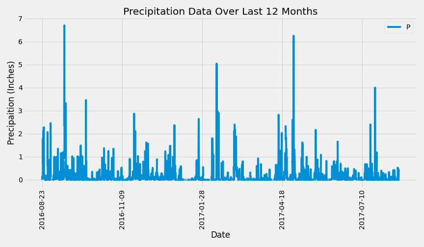
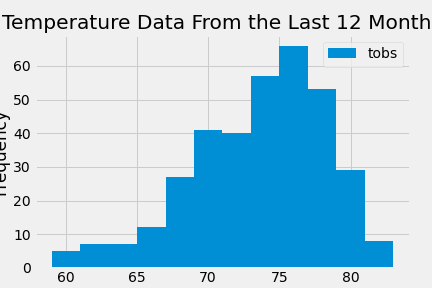
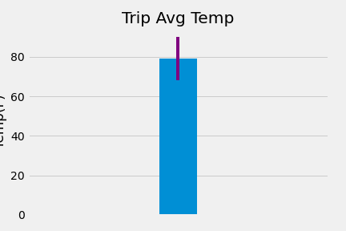
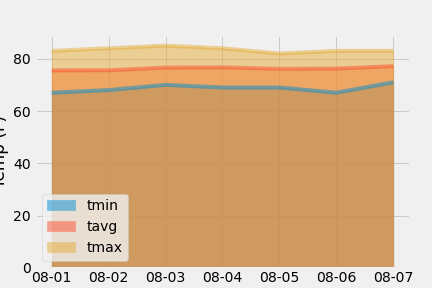

# SQLAlchemy Homework - Surfs Up!
HW 10

I've decided to treat yourself to a long holiday vacation in Honolulu, Hawaii! To help with my trip planning, I need to do some climate analysis on the area. The following outlines what I need to do.

## Step 1 - Climate Analysis and Exploration

To begin, I use Python and SQLAlchemy to do basic climate analysis and data exploration of my climate database. All of the following analysis was completed using SQLAlchemy ORM queries, Pandas, and Matplotlib.

* I used SQLAlchemy `create_engine` to connect to my sqlite database.

* I used SQLAlchemy `automap_base()` to reflect my tables into classes and save a reference to those classes called `Station` and `Measurement`.

* I linked Python to the database by creating an SQLAlchemy session.

### Precipitation Analysis

* I started by finding the most recent date in the data set.

* Using this date, I retrieved the last 12 months of precipitation data by querying the 12 preceding months of data.

* I loaded the query results into a Pandas DataFrame and set the index to the date column.

* I then sorted the DataFrame values by `date`.

* I plotted the results using the DataFrame `plot` method.

  

* I then used Pandas to print the summary statistics for the precipitation data.

### Station Analysis

* I designed a query to calculate the total number of stations in the dataset.

* I designed a query to find the most active stations (i.e. which stations have the most rows?).

  * I listed the stations and observation counts in descending order.

  * Then I found which station id had the highest number of observations.

  * Using that most active station id, I calculated the lowest, highest, and average temperatures.

  * I used the functions: `func.min`, `func.max`, `func.avg`, and `func.count` in my queries.

* Then I designed a query to retrieve the last 12 months of temperature observation data (TOBS).

  * Filtered by the station with the highest number of observations.

  * Then queried the last 12 months of temperature observation data for this station.

  * I plotted the results as a histogram with `bins=12`.

    

## Step 2 - Climate App

Now that I completed my initial analysis, I designed a Flask API based on the queries that I have just developed.

### Routes

* `/`

  * Home page.

  * This is where I listed all the routes that are available.

* `/api/v1.0/precipitation`

  * I converted the query results to a dictionary using `date` as the key and `prcp` as the value.
  
  * Returns the JSON representation of my dictionary.

* `/api/v1.0/stations`

  * Returns a JSON list of stations from the dataset.

* `/api/v1.0/tobs`
  * I queried the dates and temperature observations of the most active station for the last year of data.

  * Returns a JSON list of temperature observations (TOBS) for the previous year.

* `/api/v1.0/<start>` and `/api/v1.0/<start>/<end>`

  * Returns a JSON list of the minimum temperature, the average temperature, and the max temperature for a given start or start-end range.

## Bonus !!

### Temperature Analysis I

* Hawaii is reputed to enjoy mild weather all year. Is there a meaningful difference between the temperature in, for example, June and December?

* To investogate this I used pandas to perform this portion.

  * I converted the date column format from string to datetime.

  * I set the date column as the DataFrame index

  * Then I dropped the date column

* Then I identified the average temperature in June at all stations across all available years in the dataset. I repeated this for December.

* Next I used the t-test to determine whether the difference in the means, if any, is statistically significant. I used an un-paired t-test.

### Temperature Analysis II

* I'm looking at taking a trip from August first to August seventh of this year, but I'm worried that the weather will be less than ideal. Using historical data in the dataset I want to find out what the temperature has previously looked like.

* I used the `calc_temps` function to calculate the min, avg, and max temperatures for my trip using the matching dates from a previous year (i.e., use "2017-08-01").

* I plotted the min, avg, and max temperature from my previous query as a bar chart.

  * I used "Trip Avg Temp" as the title.

  * I used the average temperature as the bar height (y value).

  * Finally, I used the peak-to-peak (TMAX-TMIN) value as the y error bar (YERR).

    

### Daily Rainfall Average

* Now that I have an idea of the temperature I checked to see what the rainfall has been.

* I calculated the rainfall per weather station using the previous year's matching dates.

* I calculated the daily normals which are the averages for the min, avg, and max temperatures.

  * I set the start and end date of the trip as (8/1/2017-8/7/2017).

  * I used these dates to create a range of dates.

  * I stripped off the year and saved it as a list of strings in the format `%m-%d`.

  * I used the `daily_normals` function to calculate the normals for each date string and append the results to a list called `normals`.

* I loaded the list of daily normals into a Pandas DataFrame and set the index equal to the date.

* Using Pandas I plotted an area plot for the daily normals.

  
